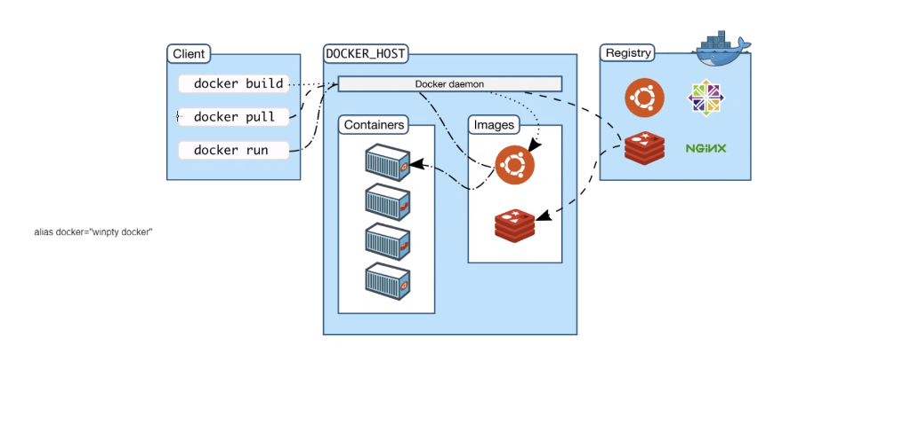

# How does docker API work?
Docker API is a set of interfaces and endpoints that allow communication with the Docker daemon, enabling users to interact with Docker containers and services programmatically. Here's a concise and unique explanation of how it works:

- **Client-Server Model**: The Docker API follows a client-server architecture. The Docker daemon (server) runs as a background process and listens for incoming API requests from Docker clients.

- **RESTful Endpoints**: The API is designed using RESTful principles, where each operation corresponds to a specific HTTP method (e.g., POST, GET, PUT, DELETE) and is addressed by a unique URL endpoint.

- **Unix Socket or HTTP**: The Docker API can be accessed either through a Unix socket or an HTTP connection, depending on the client's configuration.

- **Authentication**: When interacting with the API, clients might need to authenticate themselves depending on the security settings of the Docker daemon.

- **JSON Payloads**: Data sent to and received from the Docker API is typically in JSON format, allowing easy representation and manipulation of Docker resources like containers, images, networks, and volumes.

- **Container Operations**: Through the API, clients can create, start, stop, restart, inspect, and remove containers. They can also manage container logs, attach to their input/output streams, and execute commands within containers.

- **Image Management**: Docker API provides endpoints to pull, push, and manage Docker images, allowing users to interact with image repositories.

- **Network and Volume Management**: Clients can create and manage Docker networks and volumes, which are crucial for communication between containers and data persistence.

- **Event Streaming**: The Docker API supports event streaming, enabling clients to subscribe to real-time updates about various Docker-related activities.

- **Docker Compose**: While the Docker API provides core functionality, Docker Compose utilizes the API to enable defining and managing multi-container applications using a YAML file.

In summary, the Docker API acts as the bridge between users (clients) and the Docker daemon (server), allowing programmatic access to the Docker ecosystem's essential functionalities for container creation, management, and interaction.


### Install nginx image using api
```docker run -d -p 80:80 nginx```


enter vm created through previous command: ``` docker excec -it 417efc0c5e4f sh```

## How to commit changes and push to docker repo
1. Enter container ID and choose name```docker commit 417efc0c5e4f tech241-nginx```
2. ```docker tag tech241-nginx ryanjohal/tech241-docker```
3. ```docker push ryanjohal/tech241-docker```
4. Download image from docker and apply to local host ```docker run -d -p 90:80 ryanjohal/tech241-docker```