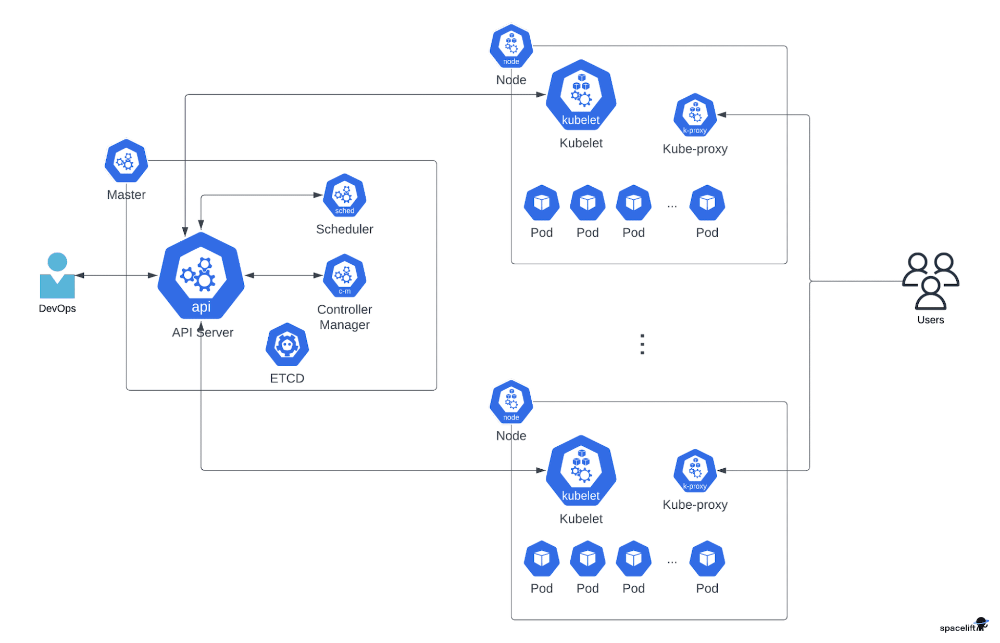

# What is K8?
## Kubernetes (K8s)
- Open-source container orchestration platform.
- Automates deployment, scaling, and management of containerized applications.
- Simplifies complex tasks in cloud environments.
- Efficiently manages and coordinates resources.
- Ensures smooth operations and scalability.

## Main Components of Kubernetes Architecture

**1. Workloads**
   - **Pod**: Fundamental compute unit, a group of containers scheduled to the same host.
   - **Deployment**: Wraps ReplicaSet, ensures a certain number of replicas of a Pod.
   - **Service**: Exposes Pods as a network service, enabling access within or externally.
   - **Job**: Starts one or more Pods and waits for successful termination.
   - **DaemonSets**: Replicates a Pod to every Node in the cluster.
   - **StatefulSets**: Provides persistent replica identities.

**2. Control Plane**
   - **API Server (kube-apiserver)**: Exposes Kubernetes REST API, used with Kubectl.
   - **Controller Manager (kube-controller-manager)**: Oversees all cluster controllers.
   - **Scheduler (kube-scheduler)**: Places Pods onto Nodes based on suitability.
   - **Etcd**: Distributed key-value storage for storing cluster state.
   - **Cloud Controller Manager**: Integrates Kubernetes with the cloud provider's platform.

**3. Nodes**
   - Physical or virtual machines hosting the Pods.
   - **Kubelet**: Acts as the Node-level agent, communicates with the control plane, and runs Pod containers.
   - **Kube-Proxy**: Facilitates network communications between Nodes.
   - **Container Runtime**: CRI-compatible runtime, like containerd, for starting containers.

Note: Kubernetes aims to simplify container management, creating a cluster of compute Nodes with a Control Plane to manage, schedule, and scale workloads efficiently.



## Why should we learn and use K8?

1. **Container Orchestration**: Kubernetes automates the deployment, scaling, and management of containerized applications, simplifying complex architectures.

2. **Scalability**: Easily scale applications by adding or removing containers based on demand, efficiently handling varying workloads.

3. **High Availability**: Distribute containers across multiple Nodes, ensuring application reliability even if a Node fails.

4. **Resource Efficiency**: Optimize resource allocation, maximizing hardware utilization and reducing costs.

5. **Declarative Configuration**: Define desired states of applications using declarative YAML files, reducing inconsistencies.

6. **Continuous Deployment**: Support CI/CD pipelines for automated testing, deployment, and rollbacks, enabling faster releases.

7. **Portability**: Run applications across various cloud providers and on-premises infrastructure, reducing vendor lock-in.

8. **Community and Ecosystem**: Benefit from a thriving open-source community and extensive tooling for Kubernetes.

9. **Industry Standard**: Kubernetes is the industry standard for container orchestration, enhancing career opportunities.

10. **Future-Proofing**: Prepare for the future of software development with containerization and cloud-native applications.

Kubernetes empowers individuals and businesses to build scalable, resilient, and efficient containerized applications, staying competitive in today's rapidly evolving technology landscape.


## Kubernetes Users

- Google
- Amazon Web Services (AWS)
- Microsoft
- Netflix
- Spotify
- Uber
- GitHub
- Adobe
- NASA

## Business Benefits of Kubernetes

- Scalability and Cost-effectiveness
- High Availability and Fault Tolerance
- Resource Efficiency and Optimal Utilization
- Faster Development and Deployment
- Flexibility and Portability
- Enhanced Application Resilience
- Improved DevOps Practices
- Increased Productivity
- Thriving Ecosystem and Community
- Future-Proofing and Modernization


## K8 Objects in Kubernetes

### Pods

- Pods are the smallest deployable units in Kubernetes.
- Each Pod represents a single instance of a running process in the cluster.
- Containers within a Pod share the same network namespace, allowing them to communicate using `localhost`.
- Pods are ephemeral and can be created, stopped, and restarted as needed.
- Kubernetes does not automatically restart Pods if they fail.

### Deployments

- Deployments provide declarative updates for Pods, ensuring the desired state of the application.
- A Deployment manages ReplicaSets (replication controller), which, in turn, manages Pods.
- Easy scaling and rolling updates for applications are supported by Deployments.
- Features like rolling updates, rollback, and version history are available.

### Services

- Services provide an abstract way to expose applications running inside Pods to the network.
- They enable load balancing and automatic service discovery within the cluster.
- Services have a stable IP address and DNS name, ensuring access to applications despite Pod restarts or changes.

### ReplicaSets

- ReplicaSets ensure a specified number of Pod replicas are running at all times.
- They guarantee high availability and desired scaling of Pods.
- Automatic corrective actions are taken by ReplicaSets when the desired number of replicas is not met (due to scaling, failures, etc.).


## Concept of Labels and Selectors in Kubernetes

### Labels

- Labels are key-value pairs attached to Kubernetes objects as metadata.
- They are used to identify and categorize resources in a human-readable and flexible way.
- Labels are typically applied to resources during their creation but can be added or modified later.
- Multiple labels can be assigned to a single resource, and the same label set can be used for different resources, promoting consistency and reusability.
- Labels do not have any semantic meaning to Kubernetes; they are for the users' interpretation and usage.
- Common use cases for labels include environment designation (e.g., "production" or "development"), application versioning, grouping by teams, and applying organizational policies.

### Selectors

- Selectors are used to query and filter resources based on their labels.
- They are expressions that define criteria for selecting resources with specific labels.
- A selector allows you to specify a set of label requirements, and only resources that match those requirements will be selected.
- Selectors are primarily used in conjunction with other Kubernetes objects like Services, ReplicaSets, Deployments, and StatefulSets to define which resources should be associated with or managed by these objects.
- When defining a selector, you can use equality-based matching or set-based matching to select resources based on specific label key-value combinations.

By utilizing labels and selectors, Kubernetes provides a flexible and efficient way to organise and manage resources within the cluster. They are crucial components in enabling various Kubernetes features, such as service discovery, load balancing, and the coordination of resources in deployments and other controller objects.


# Nginx K8
```
---
apiVersion: apps/v1 # which api to use for deployment
kind: Deployment # pod - service what kind of service/object ypi wamt tp create
# Name deployment
metadata:
  name: nginx-deployment

spec:
  selector:
    matchLabels:
      app: nginx # look for this label to ,atch with k8 service
# Create a replica set of this with instances/pods
  replicas: 3
# template to use its label for K8 service to launch in the browser
  template:
    metadata:
      labels:
        app: nginx # this label connects to the service or any other k8 components
# Define the container spec
    spec:
      containers:
      - name: nginx
        image: ryanjohal/tech241-nginx:v1
        ports:
        - containerPort: 80

```
1. Create pods ```kubectl create -f nginx-k9.yml```
2. View status of deployemnt ```kubectl get deployment```
3. View individual pods ```kubectl get pods```


# Node js K8
```
# which api to use for deployment
apiVersion: apps/v1

# pod - service what kind of service/object to create
kind: Deployment
metadata:

  # naming the deployment

  name: nodejs-app-deployment

spec:
  selector:
    matchLabels:

      # look for this label to match with k8 service
      app: nodejs-app

  # create a replica set with instances/pods
  # 3 pods
  replicas: 3

  # template to use its label for k8 service to launch in the browser
  template:
    metadata:
      labels:
        # this label connects to the service or any other k8 components
        app: nodejs-app


    # define the container spec
    spec:
      containers:
      - name: nodejs-app
        image: ryanjohal/tech241-node-app:v1
        ports:
        - containerPort: 3000

```

1. Create pods ```kubectl create -f nodejs-k8.yml```
2. View status of deployemnt ```kubectl get deployment```
3. View individual pods ```kubectl get pods```


## Nginx-Service
```
---

# Select the type of API version and type of service/object
apiVersion: v1
kind: Service

# Metadata for name
metadata:
  name: nginx-svc
  namespace: default # sre
# Specification to include ports Selector to connect to the deployment
spec:
  ports:
  - nodePort: 30001 # range is 30000-32768
    port: 80
    targetPort: 80
# Lets define the selector and label to connect to nginx deplotment
  selector:
    app: nginx # this label connects this service to deployment

  # Creating NodePort type of deployment
  type: NodePort # also use LoadBalancer - for local use cluster IP

```

## NodeJS-Service
```
---

# Select the type of API version and type of service/object
apiVersion: v1
kind: Service

# Metadata for name
metadata:
  name: nodejs-svc
  namespace: default # sre
# Specification to include ports Selector to connect to the deployment
spec:
  ports:
  - nodePort: 30003 # range is 30000-32768
    port: 3000
    targetPort: 3000
# Lets define the selector and label to connect to nginx deplotment
  selector:
    app: nodejs-app # this label connects this service to deployment

  # Creating NodePort type of deployment
  type: NodePort # also use LoadBalancer - for local use cluster IP

```

# Updated mongo deployment
```
apiVersion: apps/v1 # which API to use for deployment
kind: Deployment # pod - service what kind of service you want to create
# what would you like to call it - name the service/object
metadata:
  name: mongo # naming the deployment
spec:
  selector:
    matchLabels:
      app: mongo #look for this label to match with k8 service
    # let's create a replica set of this with instances/pods
  replicas: 1 
    # template to use it's label for k8 service to launch in the browser
  template:
    metadata:
      labels:
        app: mongo # this label connects to the service or any other k8 components
  # let's define the container spec
    spec:
      containers:
        - name: mongo
          image: ryanjohal/tech241-mongodb:latest # use the image that you built
          ports:
            - containerPort: 27017
          volumeMounts:
            - name: storage
              mountPath: /data/db
          resources:
            limits:
              memory: 512Mi
              cpu: "1"
            requests:
              memory: 256Mi
              cpu: "0.2"
              
      volumes:
        - name: storage
          persistentVolumeClaim:
            claimName: mongo-db
```

# HPA autoscaling for mongo db
```
apiVersion: autoscaling/v1
kind: HorizontalPodAutoscaler

 

metadata:
  name: sparta-mongo-db-deploy
  namespace: default

 

spec:
  maxReplicas: 9
  minReplicas: 3
  scaleTargetRef:
    apiVersion: apps/v1
    kind: Deployment
    name: mongo
  targetCPUUtilizationPercentage: 50
```
`kubectl apply -f <hpa name>`


# Node PV and PVC
### PV
```
apiVersion: v1
kind: PersistentVolume
metadata:
  finalizers:
  - kubernetes.io/pv-protection
  labels:
    type: local
  name: node-pv 
spec:
  accessModes:
  - ReadWriteOnce
  capacity:
    storage: 1Gi
  hostPath:
    path: /tmp/data
    type: ""
  persistentVolumeReclaimPolicy: Retain
  volumeMode: Filesystem
  storageClassName: manual
```
`kubectl create -f <name of the pv file>`
### PVC
```
apiVersion: v1
kind: PersistentVolumeClaim
metadata:
  name: node-pv
spec:
  accessModes:
    - ReadWriteOnce
  resources:
    requests:
      storage: 512Mi
  storageClassName: manual
```
`kubectl create -f <name of the pvc file>`

### Update deployment
```
---
apiVersion: apps/v1
kind: Deployment
metadata:
  name: node-deployment
spec:
  replicas: 3
  selector:
    matchLabels:
      app: node
  template:
    metadata:
      labels:
        app: node
    spec:
      containers:
      - name: node
        image: ryanjohal/tech241-sparta-app
        ports:
        - containerPort: 3000
        env:
            - name: DB_HOST
              value: mongodb://mongo:27017/posts
        imagePullPolicy: Always
    
      volumes:
        - name: node-pv   #Part to connect to PVC
          persistentVolumeClaim:
            claimName: node-pvc
```
`kubectl apply -f <file name>`

##### Check if it works
`kubectl get pvc`